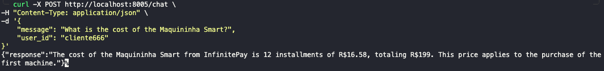
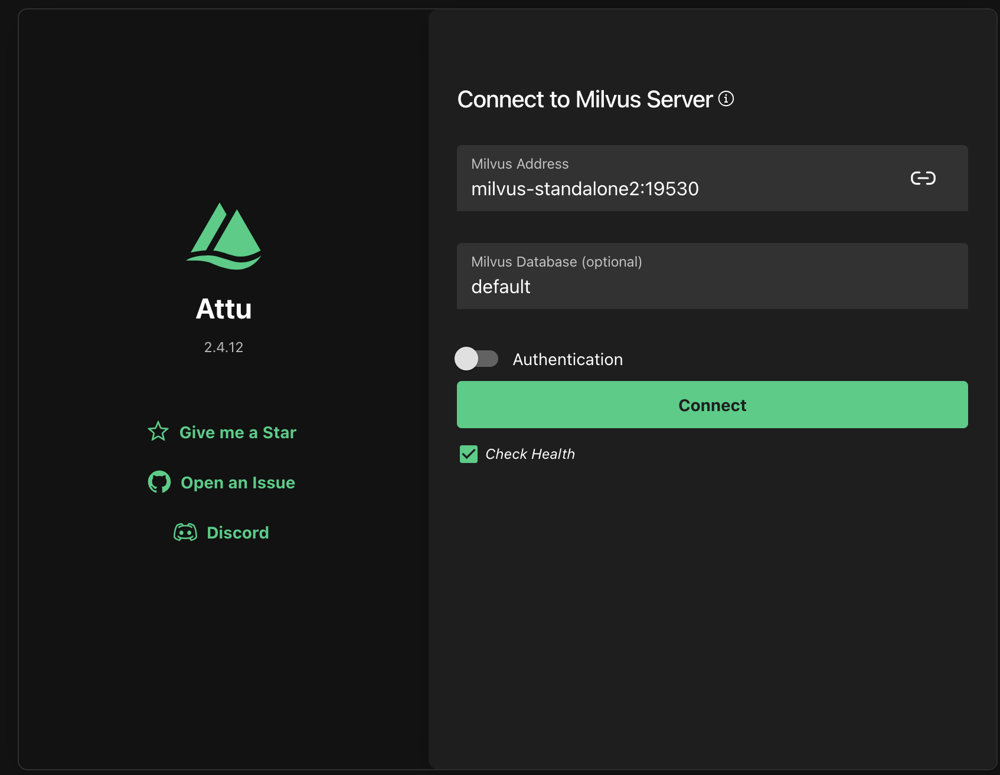

# Multi-Agent RAG System with LangGraph
This project was created for the purpose of a CloudWalk application. This task is designed to assess your software engineering skills, your understanding of AI agent concepts, and your ability to build a robust, containerized application — similar to what you’ll work on if you’re hired.

The project implements a multi-agent system using LangChain's LangGraph framework. It features a knowledge agent for answering questions based on a vector store. The application is served via a FastAPI endpoint and is fully containerized.

## ENV VARIABLES
There is this small detail that we need some API_KEYS for this project to work:

* OPENAI_API_KEY ---> Key OPENAI
* TAVILY_API_KEY ---> Key to Tavily

Create a `.env` file in the root directory and add your API keys.
```env
    // filepath: .env
    OPENAI_API_KEY=""
    TAVILY_API_KEY=""
```
## How to Run

1.  **Build and start:**
    ```sh
    docker-compose up --build
    ```

2.  **Build the vector store:**
    Once the containers are running, execute the following command in a separate terminal to populate the Milvus vector store with data from the InfinitePay website.
    ```sh
    docker-compose exec agent-swarm python build_vectorstore.py
    ```

3.  **Test the chat endpoint:**
    You can now send requests to the chat agent.
    ```sh
    curl -X POST http://localhost:8005/chat \
    -H "Content-Type: application/json" \
    -d '{
        "message": "What is the cost of the Maquininha Smart?",
        "user_id": "cliente666"
    }'
    ```
    

4.  **(Optional) View the Milvus UI:**
    You can inspect the vector store collections by navigating to `http://localhost:7071` in your browser. 
    
    ``Remember to change to milvus-standalone2 on milvus address``
    
    
    
    
    

-----
### Examples:

```curl
curl -X POST http://localhost:8005/chat \
-H "Content-Type: application/json" \
-d '{
    "message": "What are the fees of the Maquininha Smart",
    "user_id": "cliente789"
}'

curl -X POST http://localhost:8005/chat \
-H "Content-Type: application/json" \
-d '{
    "message": "What is the cost of the Maquininha Smart?",
    "user_id": "cliente789"
}'

curl -X POST http://localhost:8005/chat \
-H "Content-Type: application/json" \
-d '{
    "message": "What are the rates for debit and credit card transactions?",
    "user_id": "cliente789"
}'

curl -X POST http://localhost:8005/chat \
-H "Content-Type: application/json" \
-d '{
    "message": "How can I use my phone as a card machine?",
    "user_id": "cliente789"
}'

curl -X POST http://localhost:8005/chat \
-H "Content-Type: application/json" \
-d '{
    "message": "Minha conta está bloqueada, o que fazer?",
    "user_id": "cliente789"
}'
```